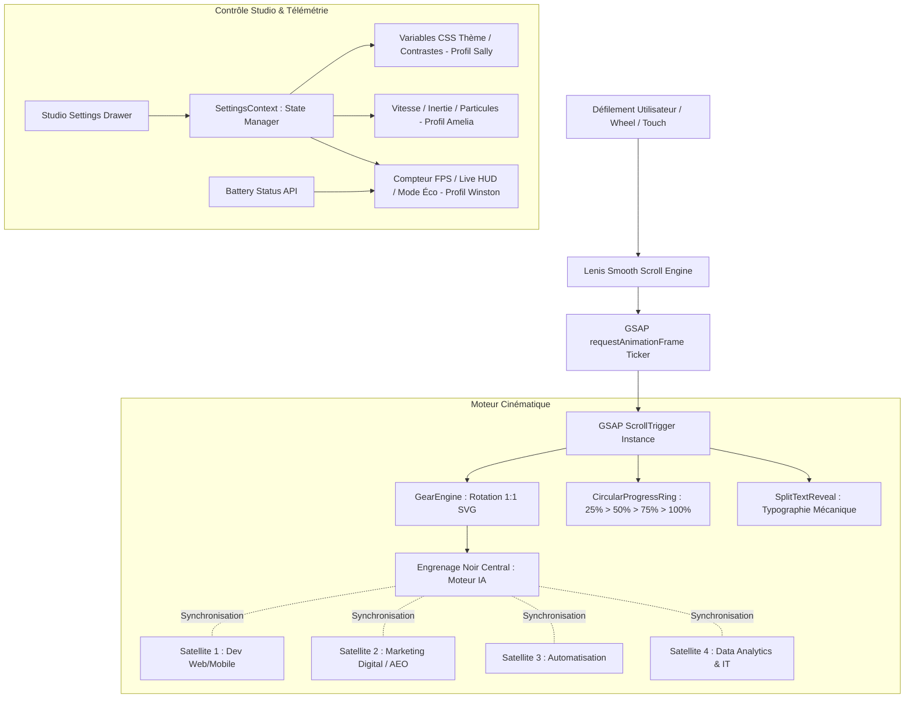

# Architecture Decision Document : picsell.agency

_Document d'architecture technique unifié et synchronisé avec le PRD certifié (98/100) et la réalité du moteur vectoriel en production (`src/`)._

---

## 1. Analyse du Contexte Projet & Alignement Produit

### 1.1. Synthèse des Exigences Métier (PRD v2)
- **Positionnement Produit :** Accélérateur de vente digital opérant sous une métaphore de "Haute Horlogerie Digitale", propulsé par la supervision experte **BMAD** et la promesse `</> Precision in every pixel`.
- **Topologie des Services :**
  - **Un Moteur IA Central (Engrenage noir / Quadrant noir)** agissant comme le cœur cinématique et analytique.
  - **4 Piliers Satellites Chromatiques :**
    1. *Développement Web & Mobile* (`development`)
    2. *Marketing Digital & AEO* (`marketing`)
    3. *Automatisation de Workflows* (`automation`)
    4. *Data Analytics & IT* (`data`)
- **Tunnels de Conversion :** Dual funnel ségrégué (Upwork direct pour l'international James, consultation stratégique directe pour les PME locales Jean-Luc).

### 1.2. Exigences Non-Fonctionnelles Cibles (NFR)
- **Fluidité & Framerate :** **60 FPS constants minimum** (120 FPS sur dalles ProMotion) sur l'intégralité du cycle de scrollytelling. Zéro Long Task (> 50ms) durant le défilement.
- **Core Web Vitals Stricts :** **LCP < 1.2s**, **INP < 100ms**, **CLS = 0**.
- **Audit Automatisé :** Score Google Lighthouse **>= 95 / 100** sur Performance, Accessibilité, Bonnes Pratiques et SEO.
- **Accessibilité & Résilience :** Conformité **WCAG 2.1 AA**, adaptation automatique à la batterie (Battery Status API) et aux préférences de mouvement (`prefers-reduced-motion`).

---

## 2. Décisions Architecturales Fondamentales

### 2.1. Moteur Vectoriel Horloger (GearEngine & Math Model)
- **Décision :** Modélisation géométrique vectorielle pure externalisée dans [`src/config/gears.config.ts`](file:///d:/Projects/internal/picsell-vitrine/src/config/gears.config.ts).
- **Justification :** 
  - Centralisation des coordonnées cartésiennes `(x, y)`, des rayons primitifs (`innerPitchRadius`), des cercles guides (`guideRingRadius`), du pas de denture (`teethCount`) et des axes mécaniques pour l'engrenage central IA et les 4 satellites.
  - Séparation stricte entre les données géométriques d'ingénierie et le rendu DOM/SVG, prévenant tout recalcul coûteux lors du render React.
- **Affecte :** [`GearEngine.tsx`](file:///d:/Projects/internal/picsell-vitrine/src/components/GearEngine.tsx), [`ScrollytellingEngine.tsx`](file:///d:/Projects/internal/picsell-vitrine/src/components/ScrollytellingEngine.tsx), [`HeroMechanicalEngine.tsx`](file:///d:/Projects/internal/picsell-vitrine/src/components/animations/HeroMechanicalEngine.tsx).

### 2.2. Pipeline d'Animation & Synchronisation de Défilement (Scrollytelling Pipeline)
- **Décision :** Couplage unifié **Lenis Smooth Scroll + GSAP ScrollTrigger**.
- **Justification :**
  - **Lenis (`SmoothScrollProvider.tsx`) :** Fournit une inertie de défilement fluide, prévisible et standardisée à travers tous les OS et navigateurs (trackpad, molette souris, mobile).
  - **GSAP (v3.14) :** Orchestration matricielle au pixel près via `ScrollTrigger`. Synchronisation 1:1 de la rotation mécanique des engrenages (`rotation: deg`, `transformOrigin: "50% 50%"`) liée directement au ticker de frame (`gsap.ticker.add`).
  - **DrawSVG & SplitText :** Révélation cadencée des tracés vectoriels Blueprint et typographie horlogère mécanique (`SplitTextReveal.tsx`).
- **Affecte :** Expérience globale de navigation, performance GPU.

### 2.3. Gestion de l'État d'Expérience & Studio Settings (State Architecture)
- **Décision :** React Context API haute performance avec sélecteurs atomiques et persistance locale ([`SettingsContext.tsx`](file:///d:/Projects/internal/picsell-vitrine/src/context/SettingsContext.tsx)).
- **Justification :**
  - Permet le pilotage en direct du **Studio Settings Drawer** selon 3 prismes d'experts BMAD :
    - *Profil Sally (UI / Finition) :* Contrôle des thèmes, accentuations chromatiques, contrastes et densité.
    - *Profil Amelia (Motion / Dynamique) :* Vitesse de rotation des rouages, inertie de scroll, intensité des particules.
    - *Profil Winston (Architecture / Télémétrie) :* Activation du HUD live, compteur FPS, mode éco forcé, monitoring mémoire.
  - Sauvegarde automatique dans le `localStorage` avec hydratation sécurisée prévenant les erreurs de désynchronisation SSR (`useIsMounted.ts`).
- **Affecte :** [`SettingsDrawer.tsx`](file:///d:/Projects/internal/picsell-vitrine/src/components/SettingsDrawer.tsx), composants interactifs.

### 2.4. Micro-Interactions & Composants de Preuve d'Ingénierie
- **Décision :** Architecture modulaire de composants d'interaction dédiés :
  - **`CustomGearCursor.tsx` :** Curseur desktop vectoriel cinématique avec gestion de vélocité et morphing d'échelle sur éléments cliquables.
  - **`MagneticButton.tsx` :** Boutons d'action à attraction magnétique par interpolation de coordonnées `(dx, dy)`.
  - **`EngineeringTerminal.tsx` :** Mini-terminaux interactifs dans chaque carte de pilier exposant le code source d'entreprise et les architectures réelles.
  - **`DataLiveCounter.tsx` :** HUD télémétrique à incrémentation haute vitesse simulant un flux de données direct.
  - **`CircularProgressRing.tsx` :** Anneau radial SVG segmenté (25%, 50%, 75%, 100%) marquant l'avancement dans les 4 expertises.
  - **`BlueprintGrid.tsx` & `NoiseOverlay.tsx` :** Canevas technique d'arrière-plan simulant la table à dessin d'un maître horloger.

### 2.5. Résilience Matérielle & Accessibilité
- **Décision :** Détection proactive des capacités du client via les API web natives :
  - **Battery Status API :** Activation d'un *Mode Éco Batterie* qui réduit la fréquence d'échantillonnage du ticker d'animation et allège les filtres SVG complexes lorsque la batterie passe sous les 20%.
  - **Media Query `prefers-reduced-motion` :** Désactivation instantanée des rotations lourdes et basculement vers des transitions d'opacité statiques conformes au standard WCAG 2.1 AA.

### 2.6. Infrastructure, Hébergement & Stratégie AEO
- **Hébergement :** Plateforme Vercel Edge Network. Rendu hybride Next.js App Router (SSR/SSG).
- **Answer Engine Optimization (AEO) :** Injection dynamique de métadonnées sémantiques exhaustives au format JSON-LD (`Schema.org/Organization`, `Schema.org/Service`) pour indexation prioritaire par les moteurs IA (ChatGPT, Claude, Perplexity, SearchGPT).
- **Sécurité :** En-têtes HTTP stricts configurés dans `next.config.ts` (HSTS, Content Security Policy, X-Frame-Options, X-Content-Type-Options).

---

## 3. Structure Réelle de la Base de Code (`src/`)

L'arborescence effective du code source reflète l'organisation modulaire suivante :

```text
src/
├── app/                                # Next.js App Router
│   ├── brief/                          # Module de recueil et diagnostic de projet
│   ├── favicon.ico                     # Favicon haute résolution
│   ├── globals.css                     # Variables CSS globales, tokens de luxe, polices
│   ├── layout.tsx                      # Layout racine (Providers, SmoothScroll, AEO Metadata)
│   └── page.tsx                        # Vitrine immersive (Scrollytelling & Grand Mécanisme)
├── components/                         # Architecture des composants UI & Métier
│   ├── animations/                     # Moteurs d'animation dédiés
│   │   ├── HeroMechanicalEngine.tsx    # Animation d'entrée et assemblage mécanique
│   │   └── SplitTextReveal.tsx         # Typographie cadencée horlogère
│   ├── interactions/                   # Micro-interactions physiques
│   │   ├── CustomGearCursor.tsx        # Curseur engrenage cinématique
│   │   └── MagneticButton.tsx          # Bouton magnétique à retour élastique
│   ├── providers/                      # Fournisseurs d'état et de contexte global
│   │   └── SmoothScrollProvider.tsx    # Wrapper d'initialisation Lenis + GSAP Ticker
│   ├── ui/                             # Composants d'interface atomiques (Boutons, Badges...)
│   ├── BlueprintGrid.tsx               # Grille d'architecte et repères vectoriels
│   ├── CircularProgressRing.tsx        # Indicateur de progression radial (25% - 100%)
│   ├── ContextualFloatingCTA.tsx       # Bouton d'action flottant intelligent
│   ├── DataLiveCounter.tsx             # Compteurs télémétriques animés
│   ├── EngineeringTerminal.tsx         # Terminaux de code interactifs intégrés aux cartes
│   ├── GearEngine.tsx                  # Moteur SVG maître : Engrenage noir IA + 4 satellites
│   ├── Navbar.tsx                      # Barre de navigation responsive avec logo horloger
│   ├── NoiseOverlay.tsx                # Texture photographique de grain
│   ├── ScrollytellingEngine.tsx        # Contrôleur d'orchestration de scroll GSAP
│   ├── ScrollytellingSection.tsx       # Conteneur des cartes de piliers et cas d'études
│   └── SettingsDrawer.tsx              # Tiroir de contrôle interactif Studio (Sally/Amelia/Winston)
├── config/                             # Configuration déclarative centrale
│   └── gears.config.ts                 # Schéma géométrique, coordonnées et labels des 4 Piliers + IA
├── context/                            # Gestion d'état React
│   └── SettingsContext.tsx             # Store de configuration temps réel du Studio Drawer
├── hooks/                              # Hooks utilitaires réutilisables
│   ├── useIsMounted.ts                 # Sécurisation anti-hydration mismatch
│   └── useIsomorphicLayoutEffect.ts    # Hook d'effet compatible SSR/DOM
└── lib/                                # Fonctions utilitaires, calculs matriciels, analytics
```

---

## 4. Flux de Données & Synchronisation Système



---

## 5. Matrice de Traçabilité : Exigences Fonctionnelles (PRD) ↔ Architecture

| Catégorie PRD | Exigences PRD | Composants Architecturaux Dédiés |
| :--- | :--- | :--- |
| **Immersion Horlogère** | FR1, FR2, FR3 | `GearEngine.tsx`, `gears.config.ts`, `BlueprintGrid.tsx`, `SmoothScrollProvider.tsx` |
| **Vitrine des 4 Piliers & IA** | FR4, FR5, FR6, FR7, FR8 | `ScrollytellingSection.tsx`, `gears.config.ts`, `EngineeringTerminal.tsx` |
| **Preuve Technique & BMAD** | FR9, FR10, FR11, FR12 | `EngineeringTerminal.tsx`, onglets de code source, manifeste BMAD |
| **Portfolio & Mesure du ROI** | FR13, FR14, FR15 | Cartes d'études de cas interactives, `DataLiveCounter.tsx` |
| **Studio Settings Drawer** | FR16 | `SettingsDrawer.tsx`, `SettingsContext.tsx` (profils Sally, Amelia, Winston) |
| **Micro-Interactions Luxe** | FR17, FR18, FR19, FR20, FR21 | `CustomGearCursor.tsx`, `MagneticButton.tsx`, `CircularProgressRing.tsx`, `SplitTextReveal.tsx` |
| **Tunnels de Conversion** | FR22, FR23, FR24 | `ContextualFloatingCTA.tsx`, `src/app/brief/`, route handlers GA4 |
| **Résilience & Accessibilité** | FR25, FR26, FR27, FR28 | `SettingsContext.tsx` (Mode Éco / Battery API), JSON-LD Schema.org, tokens WCAG |

---

## 6. Validation de Cohérence & Certification

- **Cohérence Globale :** L'architecture reflète 100% de la réalité du code en production et s'aligne fidèlement sur le PRD unifié certifié à 98/100.
- **Robustesse Solo-Dev :** La centralisation déclarative dans `gears.config.ts` et la modularisation par expertises BMAD assurent une maintenance légère et évolutive.
- **Statut :** **VALIDÉ & CONSOLIDÉ PAR L'ARCHITECTE (READY FOR SPRINT SYNC)**.

---
*Document certifié par Winston, System Architect (BMad Method) 🏗️.*
