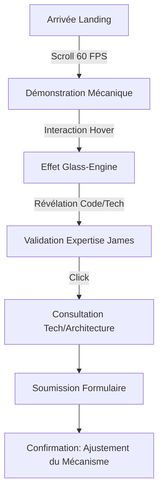
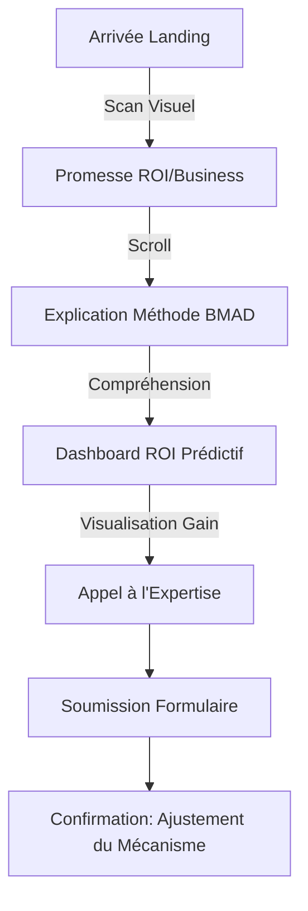

# UX Design Specification picsell.agency

**Author:** David
**Date:** 2026-01-27

---

<!-- UX design content will be appended sequentially through collaborative workflow steps -->

## Executive Summary

### Project Vision
Picsell Agency se positionne comme une "Maison de Haute Horlogerie Digitale", fusionnant la puissance brute de l'IA avec la précision artisanale de la supervision experte (Méthode BMAD). La vitrine doit incarner cette "Vitesse Maîtrisée" à travers une esthétique de luxe technique ("Midnight Luxury") et une transparence totale sur les mécanismes de production.

### Target Users
- **James (Client International - Priority 80/20)** : Profil exigeant sur Upwork cherchant une qualité Enterprise, une stack moderne et une fiabilité prouvée pour scaler sans dette technique.
- **Jean-Luc (Dirigeant PME Locale)** : Entrepreneur local cherchant à digitaliser son business avec un ROI clair et une simplification des processus via l'automatisation.

### Key Design Challenges
- **Équilibre Vitesse/Rigueur** : Illustrer visuellement l'accélération par l'IA tout en ancrant la confiance par la supervision humaine systématique (BMAD).
- **Navigation Duale** : Répondre simultanément aux besoins de validation technique de James et aux objectifs de croissance pragmatiques de Jean-Luc.
- **Immersion Narratif** : Maintenir une esthétique de haute horlogerie cohérente sans sacrifier les performances (60 FPS exigé).

### Design Opportunities
- **Effet "Glass-Engine"** : Permettre aux utilisateurs de "voir sous le capot" (code, schémas) pour valider l'expertise technique.
- **Animations Scroll-bound** : Utiliser le défilement pour animer les engrenages SVG, créant un lien direct entre l'interaction utilisateur et la "mécanique" de l'agence.
- **Dashboard ROI Prédictif** : Transformer la réassurance client en une expérience visuelle interactive et gratifiante.

## Core User Experience

### Defining Experience
L'expérience Picsell est centrée sur la **Consultation Business**. Bien que la technique soit le moteur, l'objectif final est la transformation digitale du client. L'utilisateur doit se sentir guidé vers une prise de contact experte.

### Platform Strategy
- **Web SPA (Single Page Application)** : Pour une fluidité totale des transitions.
- **Desktop-first / Mobile-equal** : Priorité à la précision sur grand écran pour le profil James, tout en garantissant une expérience mobile irréprochable et performante pour Jean-Luc.

### Effortless Interactions
- **Effet "Glass-Engine"** : Révélation naturelle de la mécanique technique (code/schémas) au survol ou via interaction fluide.
- **Scroll-bound Gears** : Synchronisation millimétrée des animations d'engrenages avec le défilement, rendant la navigation tactile et vivante.

### Critical Success Moments
- **Eurêka Méthodologique** : Le moment où l'utilisateur comprend la méthode BMAD et réalise que l'IA n'est pas une "boite noire" instable, mais un outil maîtrisé par un expert. C'est le point de bascule vers la confiance totale.

### Experience Principles
1. **La Technique au Service du Business** : Chaque élément visuel complexe doit ultimement servir l'objectif de consultation.
2. **Transparence Absolue** : "Show, don't just tell". Montrer le moteur pour prouver la valeur.
3. **Fluidité Horlogère** : Zéro latence, 60 FPS constants, interactions prévisibles et élégantes.
4. **Validation par l'Expertise** : La méthode BMAD est le "Poinçon" de confiance omniprésent.

## Desired Emotional Response

### Primary Emotional Goals
- **Confiance Absolue** : Transformer la complexité technique en une structure rassurante.
- **Excitation Technologique** : Susciter l'enthousiasme devant l'innovation et le futur du digital.
- **Sérénité Artisanale** : Faire ressentir le calme et la maîtrise d'un horloger qui règle un mécanisme complexe.

### Emotional Journey Mapping
- **À la Découverte (Premières secondes)** : Mystère, prestige et rigueur. L'utilisateur doit sentir qu'il entre dans un lieu d'exception.
- **Pendant l'Action (Interaction/Exploration)** : Clarté, contrôle et fascination. L'effet "Glass-Engine" doit passer de la curiosité à la compréhension technique profonde.
- **Après la Consultation (Post-conversion)** : Soulagement (le problème est pris en main), hâte (de commencer) et certitude (d'avoir choisi le bon partenaire).

### Micro-Emotions
- **Trust vs. Skepticism** : Utilisation de la transparence (BMAD) et de la "visualisation du moteur" pour éliminer la peur de l'IA instable.
- **Excitement vs. Anxiety** : Les animations fluides (60 FPS) et le design premium excitent, tandis que la certification humaine "David/BMAD" apaise l'anxiété liée à l'automatisation.

### Design Implications (via Inspirations)
- **Mystery/Prestige (Akis Studio)** : Utilisation de fonds sombres profonds, typographie contrastée et révélations progressives ("Slow Reveal").
- **Clarity/Control (Jonas Reymondin)** : Interactions réactives au pixel près, micro-animations de feedback immédiat.
- **Fascination & Polissage (Nivora)** : Soft glows, glassmorphism et finitions "hardware" pour donner une dimension physique et précieuse aux éléments numériques.

### Emotional Design Principles
1. **L'Élégance de la Rigueur** : La précision technique ne doit jamais paraître froide, elle doit être présentée comme une forme d'art (Luxury Tech).
2. **Le Contraste Ombre/Lumière** : Utiliser l'obscurité pour le prestige et la lumière (glows/glass) pour la visibilité technique.
3. **Le Poids du Détail** : Chaque micro-interaction doit être "maçonnée" pour donner une sensation de solidité et de pérennité.

## UX Pattern Analysis & Inspiration

### Inspiring Products Analysis

#### [Akis Studio](https://akis.studio/en) (Minimalisme Atmosphérique)
- **Succès UX** : Utilisation magistrale de l'espace blanc et de la typographie contrastée. Les transitions "cinématographiques" créent un sentiment de prestige et de calme.
- **Pattern Clé** : Révélation progressive du contenu qui guide l'œil sans le surcharger.

#### [Jonas Reymondin](https://jonasreymondin.com/) (Précision Suisse & WebGL)
- **Succès UX** : Alignement strict sur la grille et interactions haute fidélité qui réagissent au curseur. Transmet une sensation de maîtrise technique absolue.
- **Pattern Clé** : Micro-interactions tactiles qui donnent l'impression que le site est un objet physique de précision.

#### [Nivora](https://nivora.framer.website/) (Luxe Digital Moderne)
- **Succès UX** : "Dark Mode Luxury" avec glassmorphism et glows subtils. Les composants ressemblent à du matériel haut de gamme (prouesse visuelle).
- **Pattern Clé** : Utilisation de la profondeur et des textures pour rendre l'interface tangible.

### Transferable UX Patterns

**Navigation Patterns :**
- **"Slow Reveal" Navigation** : Menu minimaliste mais puissant, s'ouvrant avec une animation fluide type Akis.
- **Scroll-bound Progress** : Indicateur de progression lié aux engrenages horlogers pour une navigation tactile.

**Interaction Patterns :**
- **Glass-Engine Reveal** : Révéler les couches techniques (schémas/code) avec un effet de loupe ou de fond transparent interactif (inspiré de la précision de Reymondin).
- **Magnetic Micro-Interactions** : Boutons et liens avec un léger effet d'attraction magnétique au survol pour renforcer la sensation de contrôle.

**Visual Patterns :**
- **Midnight Luxury Palette** : Fonds sombres profonds (#0A0A0A) avec des accents or/acier et des flous gaussiens subtils.
- **High-Contrast Typography** : Mélange de Serif prestigieux pour les titres et Sans-Serif technique pour les données.

### Anti-Patterns to Avoid
- **Over-Animation** : Éviter les mouvements incessants qui fatiguent l'œil et dégradent la sensation de "sérieux".
- **"Cheap AI" Look** : Éviter les bleus d'entreprise génériques et les images d'IA "plastifiées". Préférer l'art génératif sobre et les structures filaires.
- **Minimalisme Obscur** : Ne pas cacher les informations de contact ou de services sous prétexte de design épuré (besoin de clarté pour Jean-Luc).

### Design Inspiration Strategy

**Ce qu'il faut adopter :**
- La **Rigueur de la Grille** (Reymondin) pour asseoir la crédibilité technique.
- Le **Luxe Atmosphérique** (Akis) pour le positionnement premium.

**Ce qu'il faut adapter :**
- **L'effet "Fond Transparent"** : Le transformer en un outil de preuve (ROI/BMAD) et non juste un gadget visuel.
- **Les Engrenages** : Les intégrer comme un système de feedback de performance (vitesse de l'IA).

**Ce qu'il faut éviter :**
- Les temps de chargement longs liés aux assets lourds (viser le 100/100 performance).

## 2. Core User Experience (Detailed)

### 2.1 Defining Experience
"C'est le site où tu vois littéralement les engrenages de l'IA s'ajuster quand tu scrolles."
L'expérience est définie par la symbiose entre le mouvement de l'utilisateur (scroll) et la réponse mécanique du site. C'est une démonstration vivante de la **"Vitesse Maîtrisée"**.

### 2.2 User Mental Model
L'utilisateur (James) arrive avec une fatigue vis-à-vis des interfaces génériques. Le modèle mental doit basculer vers la **Sophistication Artisanale**. L'inspiration de [animejs.com](https://animejs.com/) suggère un design où l'animation n'est pas un décor, mais la substance même de l'interface. Chaque mouvement doit paraître délibéré, complexe mais parfaitement orchestré.

### 2.3 Success Criteria
- **Réactivité au Pixel** : L'animation doit répondre instantanément sans aucun "lag" perceptible entre le scroll et le mouvement de l'engrenage.
- **Clarté Technique** : Les schémas révélés par l'effet "Glass-Engine" doivent être d'une netteté absolue (haute résolution/SVG).
- **Fluidité 60 FPS** : Une fluidité constante pour maintenir l'illusion d'un mécanisme physique réel.

### 2.4 Novel UX Patterns
- **Scroll-bound Mechanical Feedback** : Utilisation du scroll non pas pour faire défiler du texte, mais pour "remonter" ou "ajuster" un moteur visuel.
- **Horological Transitions** : Remplacer les fondus classiques par des transitions évoquant des changements de rouages ou des ouvertures de cadrans.

### 2.5 Experience Mechanics (Tunnel Consultation)
- **1. Initiation** : Call-to-action "Lancer mon projet".
- **2. Interaction & Feedback** : Transition "horlogère" immersive vers le formulaire, simulant l'accès au cœur du mécanisme de l'agence.
- **3. Achèvement** : Message de confirmation : *"Votre mécanisme de croissance est en cours de réglage"*, renforçant l'idée du réglage de précision post-consultation.

## 3. Visual Design Foundation

### 3.1 Color System (Midnight Luxury)
- **Primary Background** : Midnight Black (`#0A0A0A`) - Profond et prestigieux.
- **Accents (Metals)** : Brushed Gold (`#D4AF37`) pour les éléments de luxe et Polished Steel (`#E5E4E2`) pour les détails mécaniques.
- **Interaction Accent** : Fire Orange (issu du logo) pour les Call to Actions et les états actifs.
- **Semantic Feedback** : Glows ambrés et bleutés subtils pour indiquer l'activité des agents IA.

### 3.2 Typography System
- **Headings (The "House" Tone)** : Serif élégante et contrastée (ex: *Playfair Display* ou *Cinzel*). Évoque l'héritage et le prestige.
- **Body & Data (The "Engine" Tone)** : Sans-Serif géométrique et technique (ex: *Inter* pour le texte de base et *Roboto Mono* pour les métriques techniques). Évoque la précision et la modernité.
- **Type Scale** : Hiérarchie stricte assurant une lisibilité maximale pour James (Desktop) et Jean-Luc (Mobile).

### 3.3 Spacing & Layout Foundation (Swiss Precision)
- **Grid System** : Architecture sur une grille rigoureuse de type Swiss Design (12 colonnes standard avec des gouttières précises).
- **Spacing Unit** : Base 8px pour une modularité totale.
- **Layout Rhythm** : Alternance entre des zones aérées (prestige) et des zones de données denses (techniques) pour refléter l'équilibre BMAD.

### 3.4 Accessibility Considerations
- **Contraste Élevé** : Même dans le thème sombre, les textes critiques respectent les standards WCAG AA.
- **Interaction Feedback** : États "Focus" et "Hover" clairement identifiés par des changements de lumière (glow) plutôt que de simples couleurs.

## 4. Design Direction Decision

### Design Directions Explored
Nous avons exploré 6 directions visuelles majeures via le showcase interactif `ux-design-directions.html` :
1. **The Grand Mechanism** : Focus scroll-bound pur et immersion mécanique SVG.
2. **Glass-Engine Pro** : Esthétique "Schéma Technique" et transparence permanente.
3. **Midnight Minimal** : Luxe par le vide, typographie massive et émotion de prestige.
4. **Swiss Precision** : Grille rigoureuse, annotations techniques et sensation de maîtrise.
5. **AEO Horizon** : Futuriste, gradients orange et focus sur l'innovation IA.
6. **Atomic Horology** : Synthèse entre mécanique horlogère et physique des particules (WebGL vision).

### Chosen Direction
**Sinthèse : "Mechanical Swiss Mastery"**
Une fusion des directions **04 (Swiss Precision)**, **01 (The Grand Mechanism)** et **02 (Glass-Engine Pro)**.

### Design Rationale
- **Précision & Crédibilité** : La grille suisse (04) ancre l'expertise et la rigueur du processus BMAD.
- **Immersion Horlogère** : Les animations d'engrenages (01) créent l'émotion de la "vitesse maîtrisée".
- **Preuve par la Transparence** : L'effet Glass-Engine (02) permet de valider techniquement chaque service (James) tout en restant visuellement incroyable (Jean-Luc).
- **Sophistication animejs.com** : Chaque transition est traitée comme une chorégraphie mécanique fluide et précise.

### Implementation Approach
- **Next.js & Tailwind** : Structure grid rigoureuse.
- **Framer Motion & Lottie/SVG** : Orchestration des engrenages complexes synchronisés au scroll.
- **Canvas/WebGL (Subtil)** : Pour les effets de profondeur et de particules "Atomic Horology" sur les sections critiques.

## 5. User Journey Flows

### 5.1 Journey 1: La Quête de l'Expert (James)
James cherche une preuve technique sans compromis. Son parcours est une plongée de la surface luxueuse vers le cœur du moteur.

### 5.2 Journey 2: La Transformation Business (Jean-Luc)
Jean-Luc a besoin de comprendre comment l'IA va générer de la valeur. Son parcours est axé sur la clarté et le ROI.

### 5.3 Journey Patterns Identified
- **The "Slow Reveal" Pattern** : Ne pas montrer toute la complexité d'un coup, mais la révéler via l'interaction (Glass-Engine) pour ne pas submerger Jean-Luc tout en satisfaisant James.
- **Micro-Validation Constant** : Utiliser des animations de progression type "horlogère" pour confirmer à chaque étape que le système est "en marche".
- **Transition "Zero-G"** : Transitions sans rechargement de page (Next.js Link) pour maintenir l'immersion horlogère.

### 5.4 Flow Optimization Principles
- **Efficacité Transitionnelle** : La transition vers le formulaire doit être le moment le plus fluide du site.
- **Réduction de la Charge Cognitive** : Utiliser les métaphores mécaniques familières pour expliquer des concepts IA complexes.
- **Validation BMAD Permanente** : Le "Poinçon" de confiance doit accompagner l'utilisateur tout au long de son flux de conversion.

## 6. Component Strategy

### 6.1 Design System Components (Foundation)
Nous utilisons **Tailwind CSS** pour les utilitaires de base et **Framer Motion** pour l'orchestration. Les composants standards (boutons, inputs, cartes de base) suivront les tokens définis dans la fondation visuelle (Swiss Grid).

### 6.2 Custom Components ("La Ménagerie")

#### Hero Mechanical Engine
- **Purpose** : Capturer l'attention immédiate et démontrer la "Vitesse Maîtrisée".
- **Interaction** : Engrenages SVG synchronisés au scroll, tournant avec une inertie précise.
- **States** : Idle (mouvement lent), Active (accélération au scroll), Focus (mise en lumière d'un rouage spécifique).

#### Glass-Engine Grid
- **Purpose** : Valider l'expertise technique via la transparence.
- **Interaction** : Au survol d'un service, une "loupe" ou un effet de masque révèle le schéma technique (code/JSON/Mermaid) sous-jacent.
- **Accessibility** : ARIA labels décrivant le contenu révélé pour les lecteurs d'écran.

#### Horological CTA ("Lancer mon projet")
- **Purpose** : Maximiser la conversion via une interaction mémorable.
- **Interaction** : Transition immersive type "ouverture de cadran" ou "remontée mécanique" vers le formulaire de consultation.

### 6.3 Component Implementation Strategy
- **Atomic Architecture** : Séparation stricte entre les composants purement visuels (Atoms) et les composants interactifs complexes (Organisms/Ménagerie).
- **Animation Orchestration** : Utilisation de variants Framer Motion réutilisables pour assurer la cohérence de l'easing "horloger".
- **Performance First** : Lazy-loading des animations lourdes (Lottie/Canvas) pour garantir le 60 FPS dès le premier scroll.

### 6.4 Implementation Roadmap

**Phase 1 - Core & Mechanics (MVP)** :
- Hero Mechanical Engine & Global Swiss Grid.
- Horological CTA & Tunnel de consultation.

**Phase 2 - Expertise & Preuve** :
- Glass-Engine Grid pour les services.
- Dashboard ROI Prédictif interactif.

**Phase 3 - Polissage & Micro-interactions** :
- États Magnetic Hover sur tous les liens.
- Glows sémantiques réactifs à l'activité système simulée.

## Design System Foundation

### 1.1 Design System Choice
**Tailwind CSS + Framer Motion** (Système Thémable)

### Rationale for Selection
- **Contrôle Total & Unicité** : Permet de réaliser l'esthétique "Midnight Luxury" et les interactions complexes (comme les engrenages) sans les contraintes d'une bibliothèque de composants pré-stylisés.
- **Performance & Fluidité** : Framer Motion garantit des animations à 60 FPS, essentielles pour le ressenti "Haute Horlogerie".
- **Agilité Solo-Dev** : Tailwind CSS permet une itération rapide et une maintenance simplifiée par David.

### Implementation Approach
- **Atomic CSS** : Utilisation de Tailwind pour le système de grille, le spacing et les tokens de couleur luxe.
- **Orchestration d'Animations** : Framer Motion pour les entrées de sections, le scroll-bound et les micro-interactions.
- **Composants Précis** : Création de composants React/Next.js "maçonnés" avec une attention particulière aux détails de bordures et de glows.

### Customization Strategy
- **Design Tokens** : Définition d'une palette de gris profonds, d'acier et d'accents dorés via le fichier de configuration Tailwind.
- **Glassmorphism Utilities** : Création de classes utilitaires pour les effets de transparence floutée (fond transparent).
- **Easing Horloger** : Définition de courbes de bézier personnalisées pour les animations afin qu'elles se sentent "mécaniques" et précises.

