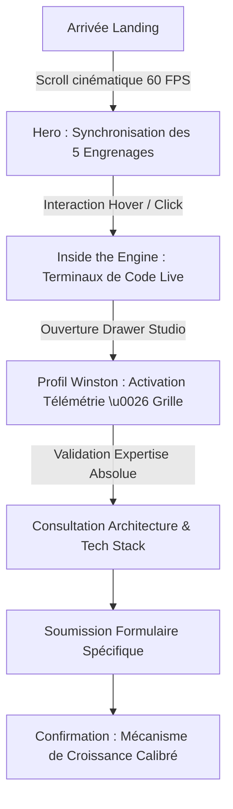
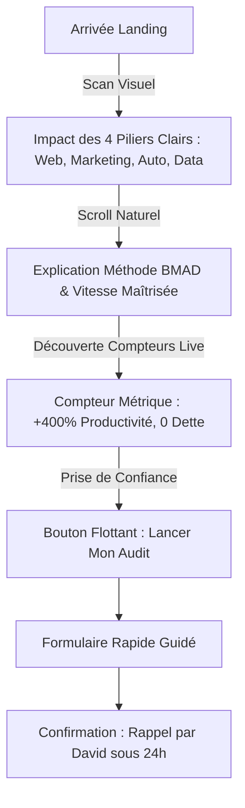

# UX Design Specification — picsell.agency

**Author:** David & Sally (UX Designer BMAD)  
**Date:** 2026-09-06  
**Status:** Validé & Harmonisé (Modèle 4 Piliers + Moteur IA Central)

---

## 1. Executive Summary

### 1.1 Project Vision
Picsell Agency se positionne comme la **« Maison de Haute Horlogerie Digitale »**, fusionnant la puissance brute de l'IA générative avec la rigueur d'ingénierie artisanale de la supervision experte (Méthode BMAD). 

La vitrine incarne cette **« Vitesse Maîtrisée »** à travers l'expérience cinématique **« Inside the Engine »** :
- **4 Piliers Satellites** en orbite synchrone :
  1. *Dév Web & Mobile* (Bleu cyan `#00F5FF`)
  2. *Marketing Digital & AEO* (Orange `#FF8A00`)
  3. *Automatisation No-Code & Make* (Vert émeraude `#00FF66`)
  4. *Data Analytics & IT Infrastructure* (Violet `#9D00FF`)
- **1 Moteur IA Central** : L'engrenage noir central (`#0A0A0A`), cœur battant qui impulse l'énergie, synchronise les engrenages et accélère la cadence.
- **Transparence Totale** : Terminaux de code live, vue blueprint technique et Studio Settings Drawer permettant de personnaliser l'expérience en direct.

### 1.2 Target Users
- **James (Client International - Priority 80/20)** : Profil exigeant sur Upwork / grands comptes cherchant une qualité Enterprise, une architecture moderne et une vélocité prouvée pour scaler sans dette technique.
- **Jean-Luc (Dirigeant PME Locale)** : Entrepreneur cherchant à moderniser son entreprise avec un ROI mesurable, des processus automatisés clairs et une agence de confiance.

### 1.3 Key Design Challenges
- **Équilibre Vitesse / Rigueur** : Illustrer visuellement l'accélération par l'IA tout en ancrant la confiance par la supervision humaine systématique (BMAD).
- **Navigation Duale & Scrollytelling** : Répondre simultanément au besoin de validation technique approfondie de James et aux impératifs de clarté commerciale de Jean-Luc.
- **Fluidité 60 FPS Immuable** : Maintenir un framerate de 60 FPS constant sur le Hero et les scènes cinématiques SVG/Canvas, avec bascule intelligente en mode éco-batterie.

### 1.4 Design Opportunities
- **Effet « Glass-Engine » & Terminaux Live** : Permettre aux visiteurs de « voir sous le capot » en inspectant les schémas d'architecture et les vrais pipelines de code.
- **Animations Scroll-bound Synchronisées (GSAP + Lenis)** : Relier le défilement tactile au mouvement physique des 5 engrenages selon les ratios mathématiques réels de `gears.config.ts`.
- **Studio Settings Drawer** : Offrir un panneau de commande interactif donnant accès aux prismes de 3 experts BMAD (Sally pour l'UI, Amelia pour les animations, Winston pour la télémétrie).

---

## 2. Core User Experience

### 2.1 Defining Experience
> *« C'est la vitrine où tu vois littéralement le moteur IA central entraîner les 4 piliers technologiques en parfaite symbiose mécanique lorsque tu scrolles. »*

L'expérience utilisateur est une chorégraphie interactive où le visiteur ressent physiquement la précision, la cadence et l'élégance de l'agence.

### 2.2 Platform Strategy
- **Architecture :** Next.js 16 (App Router) + React 19 en Single Page Application cinématique.
- **Desktop-first / Mobile-equal :** Immersion maximale et haute précision sur grand écran pour James, avec adaptation tactile optimisée et mode basse consommation pour Jean-Luc sur mobile.

### 2.3 Effortless Interactions
- **Magnetic Buttons & Smooth Cursor :** Curseur cinématique réactif avec anneau d'attraction sur les boutons d'action.
- **Scroll-bound Kinetic Sync :** Rotation différentielle et cinématique inversée des engrenages satellites calculée via le GSAP ticker.
- **Live Studio Presets :** Bascule en 1 clic entre les réglages optimisés de Sally (Finitions épurées), Amelia (Dynamique vive 60 FPS) et Winston (Télémétrie & Blueprint).

### 2.4 Critical Success Moments
1. **L'Impulsion du Moteur (Hero)** : Dès l'arrivée, l'engrenage noir central s'éveille et synchronise les 4 engrenages satellites colorés.
2. **L'Eurêka Méthodologique (Inside the Engine)** : L'utilisateur inspecte le code source dans les terminaux interactifs et réalise que l'IA n'est pas une boîte noire mais un moteur encadré par des experts.
3. **Le Poinçon de Confiance (Conversion)** : Clic sur le CTA contextuel « Configurer mon Moteur » ouvrant le formulaire de consultation personnalisé.

---

## 3. Visual Design Foundation

### 3.1 Color System (Midnight Luxury & 4-Pillar Chromatics)

Le système chromatique associe l'élégance sombre d'un boîtier horloger aux couleurs d'ingénierie des 4 piliers :

| Rôle / Élément | Couleur Hex | Signification / Usage |
| :--- | :--- | :--- |
| **Obsidian Background** | `#050505` | Fond principal, noir absolu et profond |
| **Card Glass Surface** | `rgba(255, 255, 255, 0.03)` | Surfaces vitreuses glassmorphism avec flou `backdrop-blur-md` |
| **Central AI Engine (Moteur)** | `#0A0A0A` / `#1F1F1F` | Engrenage central IA, bordures techniques sombres |
| **Pilier 1 : Dév Web & Mobile** | `#00F5FF` (Cyan vibrant) | Engrenage satellite 1 (24 dents, ratio 1.0) |
| **Pilier 2 : Marketing & AEO** | `#FF8A00` (Orange feu) | Engrenage satellite 2 (20 dents, ratio 0.8) |
| **Pilier 3 : Automatisation** | `#00FF66` (Vert émeraude) | Engrenage satellite 3 (28 dents, ratio 1.2) |
| **Pilier 4 : Data & IT** | `#9D00FF` (Violet électrique) | Engrenage satellite 4 (22 dents, ratio 0.9) |
| **Technical Steel & Wireframes** | `#E5E4E2` / `#71717A` | Grille suisse, annotations de schémas, typographies mono |

### 3.2 Typography System
- **Headings (Prestige & Horlogerie)** : Serif contrastée (*Playfair Display* / *Cinzel*) pour les titres majeurs, insufflant noblesse et prestige artisanal.
- **Body & Interfaces (Clarté Moderne)** : Sans-Serif géométrique (*Inter*) pour une lisibilité parfaite sur fond sombre.
- **Telemetry & Code (Haute Précision)** : Monospace technique (*Roboto Mono* / *JetBrains Mono*) pour les compteurs live, les terminaux de code et les annotations d'ingénierie.

### 3.3 Swiss Precision Grid Foundation
- **Grille Modulaire :** Grille 12 colonnes standard suisse, espacement basé sur un pas unitaire de `8px`.
- **Annotations Techniques :** Coordonnées d'axes, repères millimétrés et labels de debug en bordure d'écran révélant la matrice mathématique.

### 3.4 Accessibility (WCAG AA) & Eco Mode
- Contrastes minimaux de 4.5:1 sur fond `#050505`.
- Prise en compte de `prefers-reduced-motion` : arrêt des rotations automatiques continues et bascule en transitions statiques douces.
- Mode Éco Batterie automatique (`isLowPowerMode`) bridant le rafraîchissement des particules et des anneaux pour ménager le CPU/GPU mobile.

---

## 4. Design Direction Decision

### 4.1 Directions Visuelles Explorées (Showcase)
Six directions artistiques ont été modélisées dans le showcase interactif `ux-design-directions.html` :
1. **The Grand Mechanism** : Focus scroll-bound pur et mouvement mécanique SVG.
2. **Glass-Engine Pro** : Esthétique blueprint technique, transparence et terminaux live.
3. **Midnight Minimal** : Luxe par le vide, typographie imposante et épure totale.
4. **Swiss Precision** : Grille modulaire rigoureuse, annotations marginales et télémétrie.
5. **AEO Horizon** : Accents orange chaleureux, rayonnement lumineux et focalisation IA.
6. **Atomic Horology** : Synthèse entre horlogerie physique et physique des particules.

### 4.2 Direction Finale Adoptée : « Mechanical Swiss Mastery »
Une fusion harmonieuse des directions **04 (Swiss Precision)**, **01 (The Grand Mechanism)** et **02 (Glass-Engine Pro)** :
- **La Rigueur Suisse (04)** confère l'autorité et la crédibilité technique indispensable à James.
- **Le Grand Mécanisme à 5 Engrenages (01)** apporte la dramaturgie visuelle et la métaphore instantanée de la puissance d'exécution.
- **L'effet Glass-Engine (02)** fournit la preuve irréfutable par le code et les schémas techniques en direct.

---

## 5. User Journey Flows

### 5.1 Journey James (Tech Leader / Grand Compte)

```mermaid
graph TD
    A[Arrivée Landing] -->|Scroll cinématique 60 FPS| B[Hero : Synchronisation des 5 Engrenages]
    B -->|Interaction Hover / Click| C[Inside the Engine : Terminaux de Code Live]
    C -->|Ouverture Drawer Studio| D[Profil Winston : Activation Télémétrie \u0026 Grille]
    D -->|Validation Expertise Absolue| E[Consultation Architecture & Tech Stack]
    E --> F[Soumission Formulaire Spécifique]
    F --> G[Confirmation : Mécanisme de Croissance Calibré]
```

### 5.2 Journey Jean-Luc (Dirigeant PME / Croissance Locale)

```mermaid
graph TD
    A[Arrivée Landing] -->|Scan Visuel| B[Impact des 4 Piliers Clairs : Web, Marketing, Auto, Data]
    B -->|Scroll Naturel| C[Explication Méthode BMAD & Vitesse Maîtrisée]
    C -->|Découverte Compteurs Live| D[Compteur Métrique : +400% Productivité, 0 Dette]
    D -->|Prise de Confiance| E[Bouton Flottant : Lancer Mon Audit]
    E --> F[Formulaire Rapide Guidé]
    F --> G[Confirmation : Rappel par David sous 24h]
```

---

## 6. Component Strategy & Architecture Visuelle

### 6.1 Hero Mechanical Engine (5 Engrenages Synchronisés)
- **Engrenage Central IA (Noir `#0A0A0A`) :** 36 dents, ratio 1.5, vitesse maîtresse, sens horaire.
- **Engrenage 1 Web & Mobile (Cyan `#00F5FF`) :** 24 dents, ratio 1.0, sens anti-horaire.
- **Engrenage 2 Marketing & AEO (Orange `#FF8A00`) :** 20 dents, ratio 0.8, sens anti-horaire.
- **Engrenage 3 Automatisation (Vert `#00FF66`) :** 28 dents, ratio 1.2, sens anti-horaire.
- **Engrenage 4 Data & IT (Violet `#9D00FF`) :** 22 dents, ratio 0.9, sens anti-horaire.
- **Cinématique :** Pilotée par GSAP et configurée rigoureusement dans [`src/config/gears.config.ts`](file:///d:/Projects/internal/picsell-vitrine/src/config/gears.config.ts).

### 6.2 Studio Settings Drawer (`SettingsDrawer.tsx`)
- Tiroir escamotable interactif permettant aux visiteurs de tester la vitrine en temps réel selon 3 personnalités d'experts BMAD :
  - **Sally (Finitions & UI)** : Lissage d'interface, désactivation des bruits de grille, focus esthétique.
  - **Amelia (Dynamique & Animations)** : Vitesse des engrenages x1.5, effets magnétiques intenses, réactivité accrue.
  - **Winston (Architecture & Télémétrie)** : Grille blueprint visible, overlay de debug FPS/tours-minute, sound engine actif.
- Contrôles manuels : Curseur de vitesse globale (0.2x à 3.0x), toggle mode éco batterie, toggle effets sonores Web Audio API.

### 6.3 Engineering Terminals & Blueprint Grid
- Terminaux interactifs affichant de vrais fragments de code TypeScript et configurations de pipelines d'automatisation.
- Système d'onglets réactifs permettant à James de basculer entre l'implémentation du moteur cinématique et l'architecture logicielle.

### 6.4 Contextual Floating CTA (`ContextualFloatingCTA.tsx`)
- Bouton d'action persistant et magnétisé s'adaptant à la progression du visiteur dans le scrollytelling.
- Intègre un indicateur de progression circulaire horloger (`CircularProgressRing.tsx`).

---

## 7. Design System & Spécifications d'Ingénierie

- **Styling Utility :** Tailwind CSS v4 avec variables de thème HSL et design tokens centralisés.
- **Orchestration Mouvement :**
  - **GSAP v3.14 + `@gsap/react` (`useGSAP`)** pour le moteur d'engrenages et le scrollytelling ScrollTrigger.
  - **Lenis v1.3** pour un défilement inertiel soyeux synchronisé sur le GSAP ticker.
  - **Framer Motion v12** pour les transitions légères de menus, tiroirs et cartes.
- **Typage Strict & Zéro Dette :** Intégration TypeScript stricte sur tous les composants avec interfaces de props standardisées.
